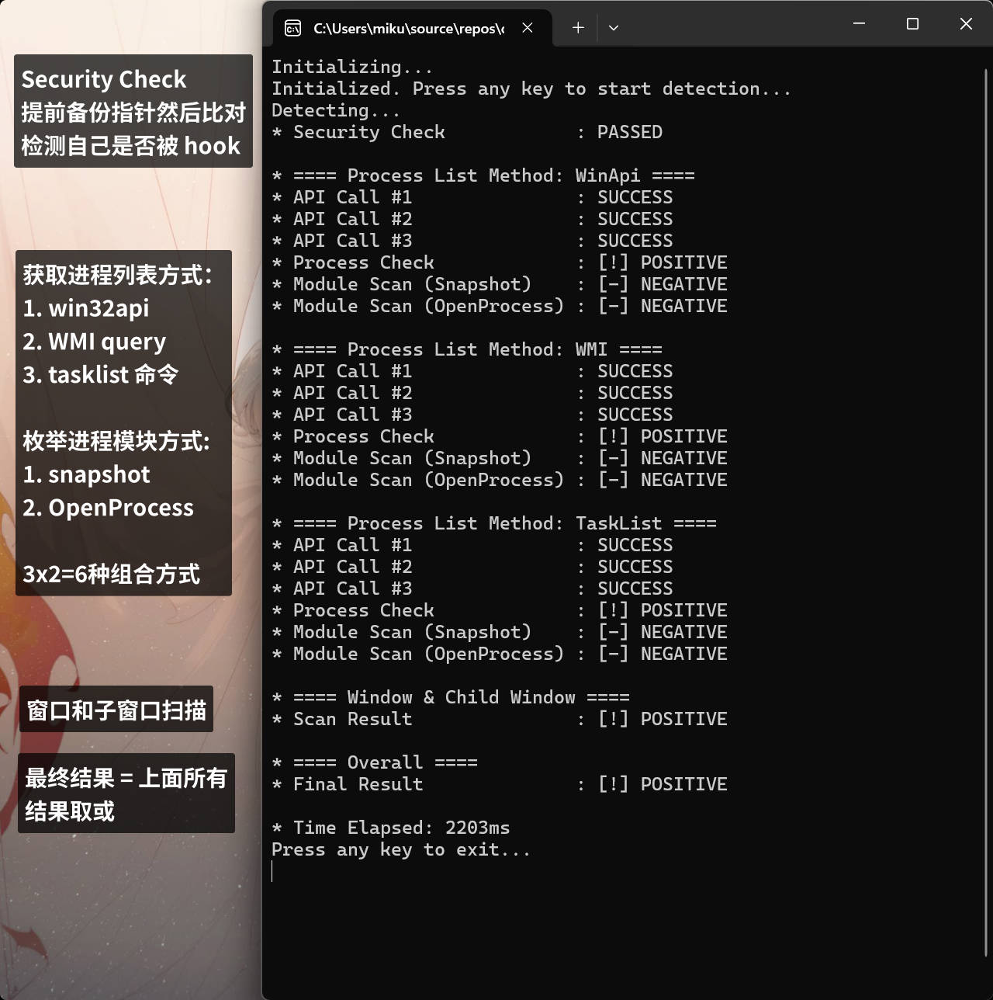
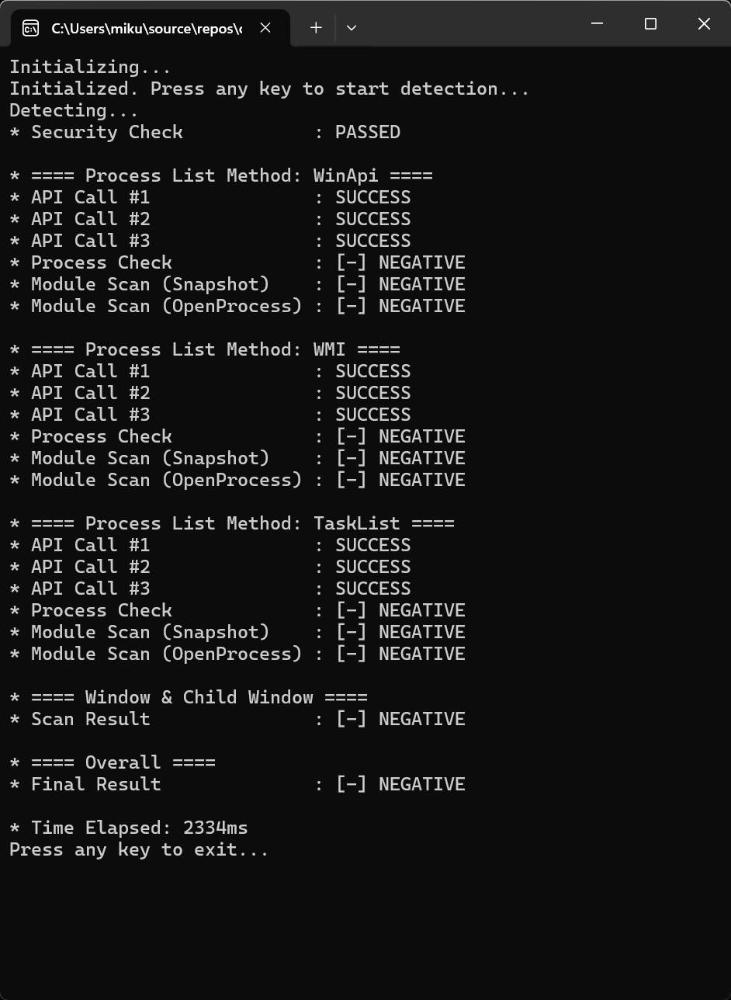

## xxx detect

## 实现功能

### 被 hook 检测

- 通过提前备份指针，可以检测到自身关键 API 被 hook
- “检测到客户端遭到恶意修改，请.....”

### 进程匹配

- 通过 win32api 获取进程列表
- 通过 WMI 获取进程列表
- 通过解析 tasklist 命令的输出获取进程列表
- 以上 3 种同时进行

### 进程模块匹配

- 通过 snapshot 方法枚举进程模块
- 通过 OpenProcess + EnumProcessModules 枚举进程模块
- 以上 2 种同时进行

说明：像 xxx.dll 等很多文件，只有 xxx 会加载

### 窗口扫描

- 递归扫描窗口的所有子窗口
- 仅仅更改 xxx 的窗口标题无法绕过扫描

## 缺点

- 如果自己为 32 位 或 xxx64 为管理员权限，则模块匹配完全失效，其他功能正常
  - 建议：如果项目本体不得不使用 32 位，可以把检测工具作为单独进程，然后进程之间通信
- 扫描速度有待优化，目前一次检测最慢 2.5s 左右
- 如果用户自己魔改了 xxx 去编译 甚至去传播...那任何特征都能抹除，我们总是慢一拍的
- 唯一出现误杀的可能：Qt 程序把自己的子窗口命名为 xxx64

|                | 客户端 32 位 xxx64 (管理员) | 客户端 64 位 xxx64 (管理员) | 客户端 32 位 xxx64 (普通) | 客户端 64 位 xxx64 (普通) |
| -------------- | ------------------------------- | ------------------------------- | ----------------------------- | ----------------------------- |
| 自身 hook 检测 | ✔                               | ✔                               | ✔                             | ✔                             |
| 进程检测       | ✔                               | ✔                               | ✔                             | ✔                             |
| 进程模块检测   | ❌                              | ❌                              | ❌                            | ✔                             |
| 子窗口检测     | ✔                               | ✔                               | ✔                             | ✔                             |

## 优点

- 屏蔽了目前所有的绕过手段
- 针对 version.dll 法，有 hook 检测 + 模块匹配 + 窗口扫描
- 针对改标题法，绕不过子窗口扫描
- 针对改文件名法，绕不过模块匹配 + 窗口扫描

## 其它能有效防止绕过检测的方法

- 检测自身加载的模块，进一步防止 version.dll 这类注入
- 对目录下组件做哈希校验
- 混淆 js 代码，cpp 二进制部分加壳/vmp
- 网络层面监控 xxx 的流量

## Demo: xxx 在运行时

## Demo: xxx 没在运行时

